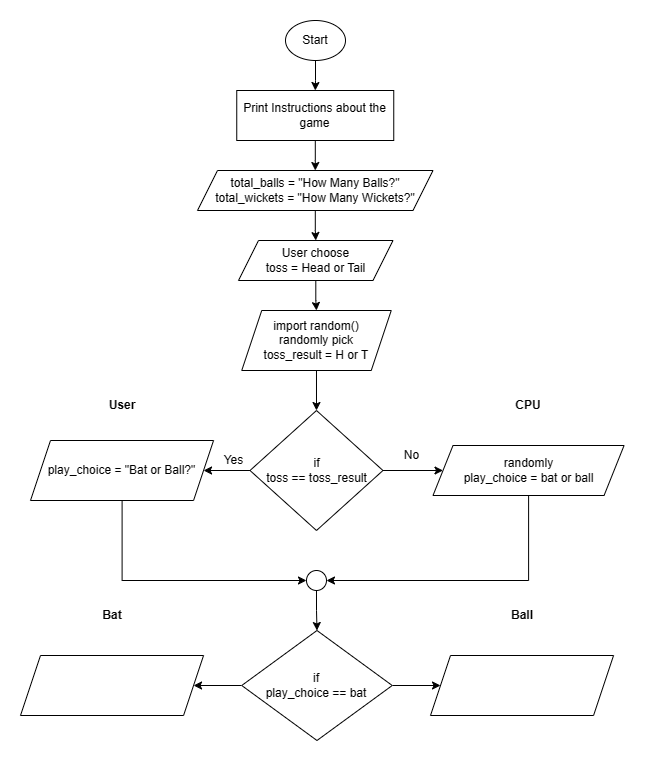

# Hand Cricket Game Project

This is a personal project to create a hand cricket game using Python. Here is the log about my daily progress on the project.

## Log

### 27th March 2023

- Set up the project repository on GitHub.
- Created the basic flowchart for the game.
- Write the code of part 1
  
